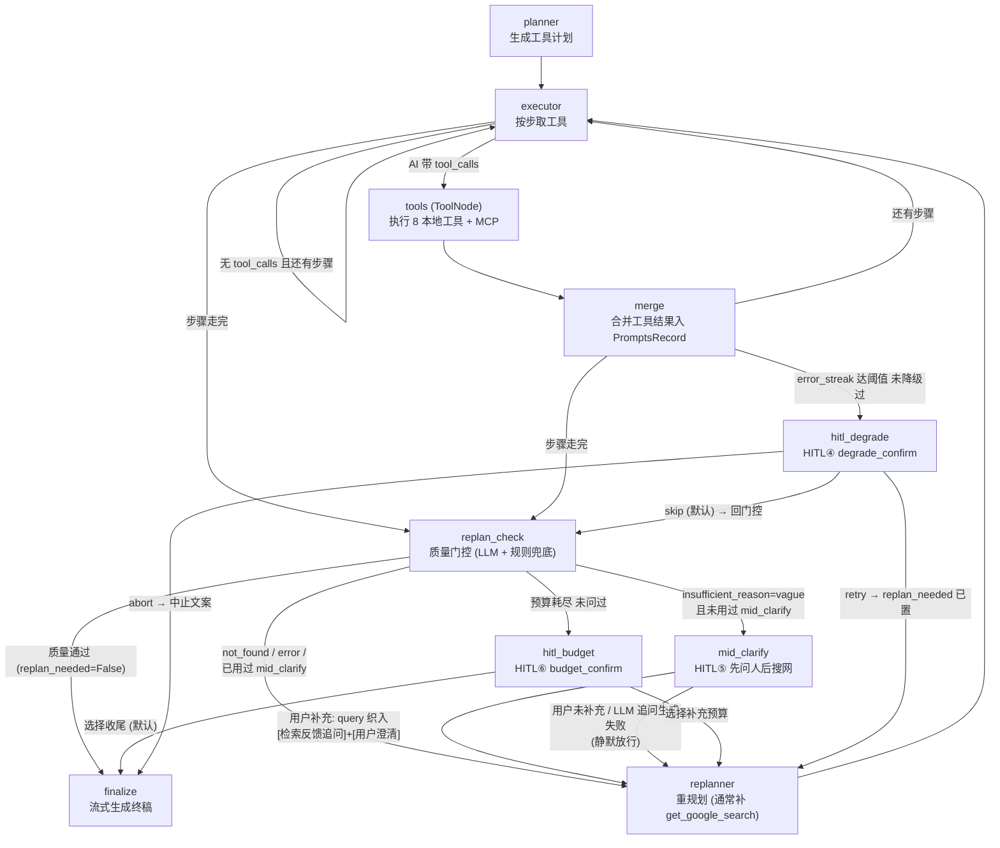
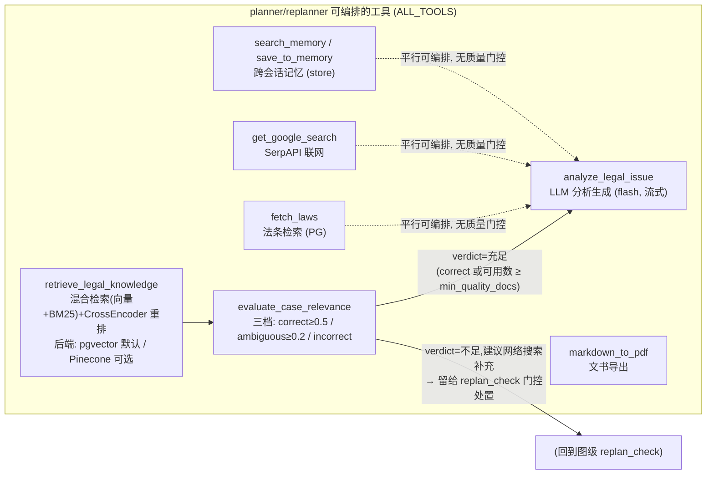

# 人工代码审查清单 — Vue 前端产品化 (2026-09-18)

> 对应计划 `docs/superpowers/plans/2026-09-18-vue-frontend-productization.md` 的 T1-T12 全部改动。
> 每项列出：文件路径 · 函数/变量名(行号) · 上游(谁调用它) / 下游(它调用谁)。
> 行号以提交时为准, 后续改动会漂移。

---

## 0. 提交清单

| Commit | 任务 | 内容 |
|---|---|---|
| 0a00d38 | T1 | json_mode 修复 — 4 个结构化节点 + 提示词字段声明 |
| 378df25 | T2/T3 | state mode/doc_type + 要素/免责/文书提示词 |
| 4af9cdf | T2 | Windows 事件循环修复 + 案例入库脚本 |
| 73c35a9 | T4 | planner/replanner CoT 流式 (raw openai SDK) |
| 8823265 | T5 | 双模式 REST 端点 + 请求模型 |
| bba2792 | T6 | SSE reasoning 事件接入 _mode_stream |
| eca88fd | T7 | /sessions /disclaimer 端点 + deprecated 标注 |
| (本次) | T9 | frontend/ 迁出 + Tailwind v4 + axios |
| (本次) | T10 | api.js / sse.js / store.js |
| (本次) | T11 | 10 业务组件 + 5 Inspira 组件 + App.vue |
| (本次) | T12 | 文档同步 + 07 册 |

---

## 1. 后端 — 图执行层

### 1.1 `lawApp_LangGraph/LangGraph_lawApp.py`

| 项 | 行号 | 上游 | 下游 |
|---|---|---|---|
| `get_executor_llm()` | 120 | 所有执行/门控节点 | ChatOpenAI(flash) 单例 |
| `_structured(schema)` | ~138 (新增) | risk_gate/element_assess/replan_check/mid_clarify 四节点 | 真实 ChatOpenAI → `with_structured_output(schema, method="json_mode")`; 冒烟替身(只收位置参数) → 按替身原签名调用 |
| `_REASONING_BUS: dict[str, asyncio.Queue]` | 222 | — (模块级单例) | planner_node / replanner_node 推帧; api._mode_stream 读取 |
| `open_reasoning_channel(thread_id)` | 225 | api._mode_stream (每次 SSE 请求开流) | 返回绑定 thread_id 的 Queue |
| `close_reasoning_channel(thread_id)` | 241 | api._mode_stream finally | 防泄漏清理 |
| `_build_elements(mode)` | 249 | ingest_node | `DOC_ELEMENT_DEFS`(prompts.py:342) / `default_case_elements()`(state.py) |
| `ingest_node(state)` | 263 | 图入口 START | 写 `mode`/`doc_type`/`case_elements`; → risk_gate_node |
| `risk_gate_node(state)` | 306 | 图边 ingest→risk_gate | `RiskSchema.with_structured_output(method="json_mode")`; interrupt(risk_confirm) |
| `element_assess_node(state)` | 375 | 图边 risk_gate→element_assess | `ElementAssessmentSchema` json_mode; interrupt(clarify); 更新 case_elements |
| `ask_element_node(state)` | 461 | 图边 element_assess→ask_element | interrupt(clarify); 更新 ClarifyExchange |
| `_parse_plan_json(raw)` | 561 | _stream_plan 内部 | `PlanSchema.model_validate`; 失败直接 raise (无兜底, 用户约束) |
| `_stream_plan(prompt_text, source, config)` | ~584 | planner_node / replanner_node | **开头有替身 seam**: 非 ChatOpenAI(冒烟替身) 走 `with_structured_output(PlanSchema)` 原签名并直接返回 verdict; 真实路径 **raw `openai.AsyncOpenAI` 流式**, 逐 chunk 取 `delta.reasoning_content` → `_REASONING_BUS[thread_id]`, content 拼接 → `_parse_plan_json` |
| `planner_node(state, config: RunnableConfig)` | 620 | 图边 element_assess/ask_element→planner | assistant 模式追加 `PLANNER_ASSISTANT_SUFFIX`; `_stream_plan(prompt, "planner", config)`; **无默认计划兜底** |
| `executor_node(state)` | 710 | 图边 planner→executor | 工具调用 (ALL_TOOLS) |
| `merge_node(state)` | 856 | 图边 executor→merge | 合并工具结果 |
| `replan_check_node(state)` | 970 | 图边 merge→replan_check | `ReplanCheckSchema` json_mode; 路由 replanner/finalize |
| `mid_clarify_node(state)` | 1061 | 图边 replan_check→mid_clarify | `MidClarifySchema` json_mode; interrupt(mid_clarify) |
| `replanner_node(state, config: RunnableConfig)` | 1131 | 图边 mid_clarify/hitl→replanner | `_stream_plan(prompt, "replanner", config)`; **无默认 2 步兜底** |
| `finalize_node(state)` | 1188 | 图边 replan_check→finalize | assistant 模式: 按 `state.doc_type` 选 `FINALIZE_DEFENSE_PROMPT`(prompts.py:376) / `FINALIZE_COMPLAINT_PROMPT`(351), laws_digest 取 law_results[:5], cases_digest 取 rag_documents[:3], 流式生成 |
| `hitl_degrade_node(state)` | 1268 | interrupt(degrade_confirm) | resume 归一 api.normalize_resume |
| `hitl_budget_node(state)` | 1343 | interrupt(budget_confirm) | 同上 |

**⚠ 审查重点 (T4/T6 主链)**:
```
浏览器 → GET /attorney/ask/stream
  → api.attorney_ask_stream (api.py:611)
  → api._mode_stream (api.py:447)
      → open_reasoning_channel(sid)              # thread_id == sid (utils.graph_config 保证)
      → graph.astream(..., stream_mode="updates")
          → planner_node → _stream_plan
              → openai.AsyncOpenAI.chat.completions.create(stream=True)
              → 每 chunk: q.put({"source":"planner","delta": reasoning_content})
      → pump() 排空 reasoning_q → out_q → ("done","")
  → sse_event("reasoning", {...}) 逐帧下发
  → 前端 sse.js streamConsult 解析 → store.state.reasoning → ThinkingPanel 渲染
```

**⚠ config 注入坑 (重要约束)**: planner_node/replanner_node/_stream_plan 的 `config` 参数
**必须**注解为 `RunnableConfig` (langchain_core.runnables) — LangGraph 1.0.1 按注解字符串
判定是否注入, `config: dict` 不会注入 (曾导致 missing config 崩溃)。

**⚠ langchain 限制**: langchain_openai 的 astream **丢弃** deepseek-reasoner 的
`delta.reasoning_content` — 所以 planner/replanner 必须走 raw openai SDK (即 _stream_plan)。

### 1.2 `lawApp_LangGraph/state.py`

| 项 | 行号 | 说明 |
|---|---|---|
| `AgentState.mode` | ~308 | `"attorney"`(默认) / `"assistant"`, ingest_node 写入 |
| `AgentState.doc_type` | ~309 | `""` / `"complaint"` / `"defense"`, ingest_node 写入 |

### 1.3 `lawApp_LangGraph/prompts.py`

| 常量 | 行号 | 消费方 |
|---|---|---|
| `RISK_GATE_PROMPT` | 32 | risk_gate_node; **尾部含 JSON 字段声明** (json_mode 必需) |
| `ELEMENT_ASSESS_PROMPT` | 50 | element_assess_node; 字段声明 + `{{}}` 转义 |
| `MID_CLARIFY_PROMPT` | 87 | mid_clarify_node; 字段声明 |
| `REPLAN_CHECK_PROMPT` | 110 | replan_check_node; 字段声明 |
| `PLANNER_SYSTEM` | 140 | planner_node; **尾部 JSON 输出声明** `{reasoning, plan[{step_id,description,tool_name}]}` |
| `REPLANNER_SYSTEM_PROMPT` | 189 | replanner_node; 同上含 `{next_id}` |
| `PLANNER_ASSISTANT_SUFFIX` | 329 | planner_node assistant 模式追加; 变量 `{doc_type_label}` |
| `DISCLAIMER_TEXT` | 335 | api GET /disclaimer |
| `DOC_ELEMENT_DEFS` | 342 | LangGraph_lawApp._build_elements: parties/claims/facts(关键) + evidence/marriage_status(非关键) |
| `FINALIZE_COMPLAINT_PROMPT` | 351 | finalize_node; 变量 {elements_digest}{query}{laws_digest}{cases_digest} |
| `FINALIZE_DEFENSE_PROMPT` | 376 | finalize_node (doc_type=defense) |

**⚠ 注意**: PromptTemplate.from_template 会解析 `{}` — 提示词里的字面花括号必须写 `{{ }}`。

---

## 2. 后端 — 基础设施层

### 2.1 `lawApp_LangGraph/db.py`

| 项 | 行号 | 说明 |
|---|---|---|
| Windows 事件循环策略 | ~29-31 | `sys.platform=="win32"` → `WindowsSelectorEventLoopPolicy`。psycopg_async 不能用 Proactor 循环 (此前 PG 一直被静默降级 InMemory, 本次才暴露真实认证错误) |

### 2.2 `lawApp_LangGraph/FastAPI/loop.py` (新文件)

| 项 | 行号 | 说明 |
|---|---|---|
| `selector_loop_factory()` | 13 | 供 uvicorn `--loop lawApp_LangGraph.FastAPI.loop:selector_loop_factory` 用; win32 返回 SelectorEventLoop |

**启动命令 (Windows + PG 必须带 --loop)**:
```bash
python -m uvicorn lawApp_LangGraph.FastAPI.api:app --host 127.0.0.1 --port 8000 \
  --loop lawApp_LangGraph.FastAPI.loop:selector_loop_factory
```

### 2.3 `lawApp_LangGraph/RAG_service/embedder.py`

| 函数 | 行号 | 上游 | 下游 |
|---|---|---|---|
| `get_embedder()` | 24 | 各检索器 | BGE 模型懒加载单例 |
| `embed_documents_sync(texts)` | 69 (新增) | scripts/ingest_cases_pgvector.py | `get_embedder().encode(batch_size=32)` |
| `embed_documents(texts)` (async) | 85 (新增) | pgvector 检索器 | `asyncio.to_thread(embed_documents_sync)` |

### 2.4 `scripts/ingest_cases_pgvector.py` (新文件)

链路: `main` → 遍历 `data/Documents/MarkDownFiles/` 11 案例 → 滑窗切块(500/重叠50, id=`{stem}::{i}`) →
`embed_documents_sync` **256 条/批切片** (整批 encode 会原生崩溃 exit 2816) →
`INSERT ... ON CONFLICT (id) DO UPDATE` → law_cases 表。`__main__` 设 Selector 策略。
全量 4855 块, 嵌入约 19 分钟。**未执行** — 被 DB_PASSWORD 阻塞。

---

## 3. 后端 — API 层 (`lawApp_LangGraph/FastAPI/`)

### 3.1 `model.py`

| 类 | 行号 | 字段约束 |
|---|---|---|
| `AttorneyAskRequest` | 17 | query 1-5000 + session_id 可选 |
| `AssistantAskRequest` | 24 | case_details **20-20000** + doc_type `Literal["complaint","defense"]` + session_id 可选 |

### 3.2 `utils.py` (未改动, 但链条必读)

| 函数 | 行号 | 在新链路中的角色 |
|---|---|---|
| `graph_config(session_id)` | 27 | `thread_id == session_id` — _REASONING_BUS 的键控前提 |
| `extract_interrupt(snapshot)` | 34 | /sessions/{sid} 与 /attorney/ask 的 interrupt 载荷 |
| `normalize_resume(interrupt_type, answer)` | 51 | 六类 interrupt 归一; **类型字符串精确不可改** |
| `build_response(state, session_id)` | 132 | 所有 ask 端点共用响应组装 |
| `sse_event(event, data)` | 159 | SSE 帧格式 `data: {"event":E,"data":D}\n\n` — 前端 sse.js 的解析契约。**已修双重编码**: data 保持原类型(str 原样, dict/list 结构化直传), reasoning 帧 `e.data.delta` 才能成立 |

### 3.3 `api.py`

| 项 | 行号 | 上游 | 下游 |
|---|---|---|---|
| `_finalize_or_interrupt(session_id, values)` | 116 | attorney_ask / assistant_ask / ask | build_response + extract_interrupt |
| `_safe_upsert_session(sid)` | 149 | 三个 ask 端点 | db.upsert_session (失败仅 warning) |
| POST `/attorney/ask` | 191 | 前端 api.askAttorney | ainvoke({query, mode:"attorney"}) → _finalize_or_interrupt |
| POST `/assistant/ask` | 219 | 前端 api.askAssistant | ainvoke({query, mode:"assistant", doc_type}) → _finalize_or_interrupt |
| GET `/disclaimer` | 255 | DisclaimerToast | DISCLAIMER_TEXT |
| GET `/sessions` | 263 | HistorySidebar | `SELECT session_id,meta,last_active_at ORDER BY last_active_at DESC LIMIT 50` (get_pool) |
| GET `/sessions/{sid}` | 280 | HistorySidebar | aget_state; 404 当 `not snap or not snap.values` |
| `_validate_stream_text(text, 4000)` | 439 | _mode_stream | HTTPException 413 |
| `_mode_stream(mode, query, doc_type, sid)` | 447 | 两个 */ask/stream 端点 | 核心见 §1.1 主链; run()+pump() 双任务合并 out_q; **reasoning 帧先于 done (pump 排空后才发 done)** |
| ↳ `pump()` | 484 | _mode_stream | reasoning_q → out_q |
| ↳ `run()` | 494 | _mode_stream | graph.astream updates/values 双模式 → token/progress/tool_call/tool_result/elements/reasoning/interrupt/answer/session_id 事件 |
| GET `/attorney/ask/stream` | 611 | App.vue submit | _mode_stream("attorney",...) |
| GET `/assistant/ask/stream` | 617 | App.vue submit | _mode_stream("assistant",...); 422 当 doc_type 非法 |
| `/ask`, `/ask/stream` | 162/323 | — | **deprecated 标注** (二期移除) |

### 3.4 六类 interrupt 精确字符串 (前后端契约, 不可改动)

`risk_confirm` / `clarify` / `pdf_confirm` / `degrade_confirm` / `mid_clarify` / `budget_confirm`
— 产生于 LangGraph_lawApp 各 hitl 节点, 归一于 utils.normalize_resume, 渲染于前端 InterruptPanel.TYPE_UI。

---

## 4. 前端 (`frontend/src/`)

### 4.1 数据层

| 文件 | 导出 | 上游 | 下游 |
|---|---|---|---|
| `api.js` | `askAttorney`/`askAssistant`/`resumeHITL`/`listSessions`/`getSessionDetail`/`fetchDisclaimer` | axios baseURL `/api` (vite proxy → 127.0.0.1:8000) | InterruptPanel/HistorySidebar/DisclaimerToast |
| `sse.js` | `streamConsult(url, onEvent, signal)` | fetch ReadableStream; 解析 `data: {json}\n\n` 帧 (对齐 utils.sse_event) | App.vue submit |
| `store.js` | `state`(reactive) / `setSession` / `markDisclaimerShown` / `resetTurn` / `useTypewriter(full, shown, cps=60)` | localStorage `lawapp_sid`/`lawapp_disclaimer` | 全部组件 |
| `lib/utils.js` | `cn(...)` | clsx + tailwind-merge | inspira 组件 |

### 4.2 组件 (`src/components/`)

| 文件 | 关键函数/数据 | 上游 | 下游 |
|---|---|---|---|
| `ModeSwitch.vue` | `pick(id)` | 点击 | state.mode + resetTurn (单界面切模式) |
| `DisclaimerToast.vue` | `onMounted`→fetchDisclaimer | /disclaimer | markDisclaimerShown (非阻塞) |
| `HistorySidebar.vue` | `onMounted`→listSessions; `open(sid)`→getSessionDetail; `citationsOf(d)` | /sessions, /sessions/{sid} | setSession, CitationList |
| `ChatView.vue` | `lastAssistant`(computed); `full`/`shown` refs; `useTypewriter` | store.messages | 打字机 60cps 追平 + ▍光标; 用户消息>120字折叠 |
| `ThinkingPanel.vue` | `head`(computed, 尾 60 字) | store.reasoning/Active/Error | details 折叠 CoT |
| `ToolTimeline.vue` | — | store.tools | inspira/Timeline |
| `ElementPanel.vue` | `STATUS_UI` | store.elements (SSE elements 事件 `[{key,label,status}]`) | 三色状态渲染 |
| `CitationList.vue` | — | HistorySidebar detail (law_results+rag_documents) | `.font-citation` 衬线 (用户决策) |
| `InterruptPanel.vue` | `TYPE_UI` 六类映射; `send(answer)`→resumeHITL | /ask/resume → normalize_resume | emit('resumed') → App.onResumed; 自助输入框 |
| `DocComposer.vue` | `send()`; docType radio (complaint/defense) | App submit | inspira/ShimmerButton; attorney 单行/assistant textarea 统一提交区 |
| `inspira/DotPattern.vue` | SVG pattern | — | App 背景 |
| `inspira/ShimmerButton.vue` | CSS shimmer 动画 | — | DocComposer |
| `inspira/TypingAnimation.vue` | `tick()` 打字循环 | — | App 空态提示 |
| `inspira/Timeline.vue` | motion-v 逐项淡入 | — | ToolTimeline |
| `inspira/FadeIn.vue` | motion-v 挂载淡入 | — | ChatView 消息 |

> Inspira 官方站点 (inspira-ui.com) 页面不可达 (404/改版), 5 个动效组件按 Magic UI 公开行为手写,
> 文件头均有标注 — **如需官方版可后续替换, 接口不变**。

### 4.3 `App.vue` 主链

```
DocComposer @submit → App.submit({text, docType})
  → resetTurn() + push user/assistant 消息
  → 按 state.mode 构造 /api/{attorney|assistant}/ask/stream?... URL
  → sse.streamConsult(url, onEvent)
      reasoning → state.reasoning += e.data.delta   (ThinkingPanel 实时渲染)
      token     → assistant.text += e.data          (ChatView 打字机)
      tool_call/tool_result → state.tools
      elements  → state.elements
      interrupt → state.interrupt                   (InterruptPanel 挂面板)
      answer    → assistant.text
      session_id→ setSession
      error     → state.error (不做兜底, 直接显示)
      done      → assistant.done = true
InterruptPanel @resumed → App.onResumed(r)
  → r.interrupt 有则继续挂面板; r.final_answer 追加 assistant 消息
```

---

## 5. 测试与脚本

| 文件 | 说明 | 状态 |
|---|---|---|
| `tests_ipynb/02_llm.ipynb` (cell 6/7) | 静态检查改为按源码推导 json_mode/legacy — 模型节点切换后自动判定 | PASS 9 / FAIL 2 (pro planner 已走 _stream_plan, 下次运行自动翻绿) |
| `scripts/gen_nb07.py` | 07 册生成器 (源码即文档) | ✅ |
| `tests_ipynb/07_dual_mode_api.ipynb` | 起真实 uvicorn 子进程实测: disclaimer/两模式 ask/双模式 SSE/413·422·404 守卫/sessions (PG 不通显式 SKIP) | 见运行日志 |
| `scripts/diag_sse_07.py` / `scripts/diag_nb07.py` | 诊断脚本 (临时, 可删) | 已用于定位 |

---

## 6. 已知阻塞 (需要用户操作)

1. **DB_PASSWORD 认证失败** — `lawApp_LangGraph/.env` 中密码被 127.0.0.1:5432 postgres 拒绝。
   修复后需: ① `python scripts/ingest_cases_pgvector.py` (~19 分钟入库) ② 重跑 03/04 册
   ③ 06 册 ④ 07 册 sessions 检查。当前 PG 全链路 (检索/审计/checkpoint) 降级运行。
2. **02 册 pro 行两条 FAIL** — 历史遗留判定, planner 已改 _stream_plan 后应自动翻转, 建议重跑确认。

## 7. 重点人工复核建议 (优先级序)

1. `LangGraph_lawApp.py:572` **_stream_plan** — raw SDK 流式 + regex JSON 解析 + 无兜底语义 (核心)
2. `FastAPI/api.py:447` **_mode_stream** — run/pump 双任务时序, reasoning 先于 done 的保证
3. `prompts.py:140/189` — planner/replanner JSON 输出声明与 PlanSchema 字段一致性
4. `prompts.py:351/376` — 两份文书模板的要素占位与 finalize_node 变量填充
5. `InterruptPanel.vue` TYPE_UI ↔ `utils.py:51` normalize_resume 六类字符串对齐
6. `sse.js` 帧解析 ↔ `utils.py:159` sse_event 格式契约
7. `scripts/ingest_cases_pgvector.py` — 切块/幂等/批大小 (执行前复核)

---

## 8. 人工检索流程梳理 — mermaid 流程图 (2026-09-20, 仅梳理不动代码)

> 范围: 案例检索 + 检索反馈 HITL(mid_clarify「先问人后搜网」)闭环。
> 本节只画清现状 + 列优化点, **不改任何代码**; 优化项待拍板后另行立项。

### 8.1 检索闭环主链路 (图级)



文字锚点 (行号以 2026-09-20 为准, 会漂移):
- 路由函数: `route_after_executor` / `route_after_merge` / `route_after_replan_check`
  (`LangGraph_lawApp.py` ~1480-1560); 门控优先级 = 质量通过 > 预算 > vague问人 > replanner。
- `mid_clarify_node` (~1090): `MidClarifySchema` json_mode 生成追问 → `interrupt(mid_clarify)`;
  未补充 → `{"mid_clarify_used": True}` 静默放行; 补充 → query 织入 + `case_elements.update(by="mid_clarify")`。
- `_fallback_replan_check` (~1057): replan_check 的 LLM 失败时**规则兜底** — 行为决策级兜底,
  非"不做兜底"约束针对的错误掩盖, 但梳理时值得复核两者边界。

### 8.2 executor 内 CRAG 工具链 (细粒度)



关键事实 (代码锚点):
- `retrieve_legal_knowledge` (`rag_tools.py:64`): **后端异常时优雅降级** 返回
  `status=error` (不中断流程, 由 Agent 自决是否联网) — 工具级设计意图, 与全局"不做兜底"
  约束不冲突但需审查者知晓。
- `evaluate_case_relevance` (`rag_tools.py:160`): 阈值来自 settings (`correct_threshold` /
  `incorrect_threshold` / `min_quality_docs`), **只评估案例库**, 不评估法条/联网结果。
- `analyze_legal_issue` (`rag_tools.py:275`): 上下文 = PromptsRecord 的 法条+案例+联网 三源拼接。
- 用户澄清织入后的 query 是**后续 planner/executor/检索的唯一基准**
  (`LangGraph_lawApp.py` ~527 注释)。

### 8.3 现状问题与优化点清单 (待拍板, 优先级序)

| # | 优先级 | 现状 | 问题 | 优化方向 | 证据 |
|---|---|---|---|---|---|
| O1 | 高 | mid_clarify 仅在 `vague` 触发; `not_found` 直接联网 | 案例库覆盖不到时**不问人**, 联网质量不可控且用户语境丢失 | not_found 且首轮也可考虑问人(如管辖/地区/时间), 或至少在追问面板提示"案例库未覆盖, 将联网" | route_after_replan_check ~1555 |
| O2 | 高 | mid_clarify 的 top_docs 检索为空时 = "(检索为空)" | 空上下文喂给追问 LLM, 追问只能泛泛而谈 | not_found 场景追问应改基于 query 本身的要素缺口(复用 case_elements), 而非"检索到的案例集中在…" | mid_clarify_node ~1107/1128 |
| O3 | 中 | 联网结果 `get_google_search` **无质量评估环节** | CRAG 三档评估只覆盖案例库; 网页 snippet 直接入分析上下文 | 增加联网结果轻量评估(时效/来源)或至少长度/条数过滤 | rag_tools.py 只评 rag_documents |
| O4 | 中 | 评估阈值全局固定 (0.5/0.2) | hybrid_score 绝对阈值跨 query 稳定性存疑; 不同案由分布不同 | 阈值按 namespace/案由分层, 或改相对分位; 先做离线统计再定 | settings + evaluate_case_relevance |
| O5 | 中 | mid_clarify `context_hint` 截 200 字 | 前端 HITL 面板信息量不足, 用户难判断"检索集中在哪" | hint 提为案由+年份分布摘要(比塞原文更有用) | mid_clarify_node ~1128 |
| O6 | 低 | replan_check LLM 失败走规则兜底 | 与"不做兜底"约束的边界需明确声明 | 文档化即可(本节已声明); 若要严格对齐约束, 需用户拍板是否改为直接报错 | _fallback_replan_check ~1057 |
| O7 | 低 | 检索后端异常返回 status=error 继续走 | Agent 拿到 error 文案后自行决定下一步, 可能多绕一轮 | error 结果附"建议动作"(直接联网)降低规划不确定性 | rag_tools.py:107-117 |
| O8 | 低 | 法条 fetch_laws 无质量门控 | 法条空结果不影响 replan_check 判定 | 法条为空的场景在门控 insufficient_reason 中显式区分 | db_tools.py:207 |

> 以上均为**梳理结论**, 未动任何代码。要实施哪几项, 圈选后走 brainstorming → spec → plan 流程。
