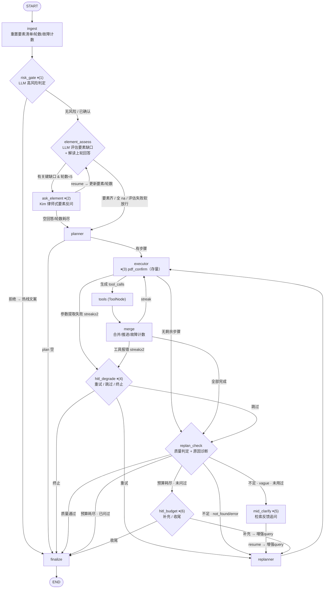

# 子项目 A「问询与协同」设计文档 — 要素驱动澄清循环 + 执行中 HITL

- 日期：2026-09-10
- 状态：已与用户逐节确认，待 spec 审阅
- 分支：upgrade-v1
- 上游：A1（LangGraph 1.x 升级）、A2（MCP 双向）已合入

## 1. 背景与定位

本项目为**求职/作品集展示项目**，本轮为三大改进方向（A 问询与协同 / B 记忆系统 / C 工程地基）中的 **A**，优先实施。架构完整度与可讲性优先，不需要生产级运维配套。

现状问题（均有代码出处）：

1. 澄清能力弱：`clarify_node` 每轮请求最多反问一次（`clarification_round` 上限 1，`LangGraph_lawApp.py:214`），无要素清单、无多轮循环、反问与检索结果零联动
2. HITL 时机单薄：仅入口风险确认、事实反问、PDF 确认三处固定点；执行中的工具连续失败、重规划预算耗尽等场景无人介入（预算耗尽直接硬编 finalize）
3. 提示词散落且人格分裂：分析用 Kim Wexler，finalize 兜底却是"七成理智二成傲娇"（`LangGraph_lawApp.py:841`），反问是无名助手

## 2. 已确认决策记录

| # | 决策点 | 结论 |
|---|--------|------|
| 1 | 项目定位 | 求职/作品集，架构可讲性优先 |
| 2 | 实现方案 | 方案一：显式图拓扑扩展（9→14 节点），澄清循环成为图上可见的环 |
| 3 | 问询形态 | 要素清单驱动自适应：LLM 判定要素缺口，只问关键缺失，单次 ≤3 要素打包成自然问句 |
| 4 | 澄清轮数上限 | **5 轮**（`MAX_CLARIFY_ROUNDS = 5`），到达上限软放行 |
| 5 | 澄清时机 | 入口要素澄清 + 执行中检索反馈联动（评估"不足"且原因=笼统 → 追问用户，而非直接联网） |
| 6 | 新增 HITL 触发点 | 工具连续失败 ×2 → 问人（重试/跳过/终止）；重规划预算耗尽 → 问人（补充/收尾）。不新增联网搜索前确认 |
| 7 | 角色策略 | Kim Wexler 全链路统一（反问/分析/兜底）；Saul 保留为 `LEGAL_ANALYSIS_ROLE=saul` 环境变量彩蛋，仅影响分析角色 |
| 8 | 测试形式 | 新功能测试 100% ipynb（三个 notebook）；pytest 存量仅就地最小更新保持冒烟绿 |
| 9 | 设计文档 | 图一律用 mermaid |

## 3. 目标 / 非目标

**目标**

- G1 入口澄清：要素清单驱动的多轮自适应问询（≤5 轮），闲聊零反问直通
- G2 检索反馈联动：`replan_check` 诊断"不足原因"，笼统 → 追问用户细化后重检索，检不到 → 联网兜底
- G3 故障兜底 HITL：工具连续失败、重规划预算耗尽两类执行中场景把决定权交给用户
- G4 提示词工程：集中到 `prompts.py` 单一模块，Kim 人设全链路统一，版本化注释
- G5 可演示性：SSE 推送要素面板状态，图拓扑可可视化（`langgraph dev` / LangSmith）

**非目标（留给 B/C）**

- 短期记忆压缩、长期记忆自动固化（B；但 `case_elements`/`clarify_history` 的字段设计为其预留原料）
- 日志 JSON 化、pydantic 工具返回 schema 化、AgentState 死字段清理（C）
- 前端页面实现（只定义 SSE/响应载荷形状）
- MCP 侧改动（`ALL_TOOLS`/`TOOL_BY_NAME` 机制不受影响）

## 4. 数据模型设计（state.py）

### 4.1 案件要素清单

```python
ElementStatus = Literal["known", "missing", "na"]

class CaseElement(BaseModel):
    key: str                       # 如 "marriage_status"
    label: str                     # "婚姻现状"
    critical: bool                 # 关键要素（缺失必问；可被评估 LLM 动态提升）
    status: ElementStatus = "missing"
    value: str = ""                # 已收集事实摘要
    updated_by: str = "init"       # init / assess / ask / mid_clarify

class CaseElements(BaseModel):
    elements: list[CaseElement]    # ingest 时重建默认清单
    def digest() -> str            # 供提示词注入："婚姻现状:在婚分居 | 财产:一套房双方名下 | …"
    def critical_missing() -> list[CaseElement]
    def mark_na(keys: list[str])
    def promote(keys: list[str])
    def update(key: str, value: str, by: str)   # status=known + 摘要

class ClarifyExchange(BaseModel):  # 澄清历史（append reducer）
    round: int
    question: str
    answer: str
    element_keys: list[str]
    at: str                        # ISO 时间
```

### 4.2 默认要素清单（婚姻家事，与语料库领域对齐）

| key | label | 默认关键级 |
|-----|-------|-----------|
| `marriage_status` | 婚姻现状（在婚/分居/已进入诉讼） | 关键 |
| `demand` | 核心诉求 | 关键 |
| `property` | 主要财产与归属 | 关键 |
| `children` | 子女情况（数量/年龄/抚养安排） | 常规 |
| `timeline` | 关键时间线（结婚年限/财产取得时点） | 常规 |
| `evidence` | 手头证据 | 常规 |
| `opposing_stance` | 对方态度 | 常规 |

自适应三维度：状态机（known/missing/na，非法律问题全 na 跳过）、关键级动态提升（按案由，如彩礼纠纷 → `timeline` 升关键）、软退出（5 轮上限后仍缺要素不阻塞，放行进 planner 并在 reasoning 记录）。

### 4.3 AgentState 字段变更

| 变更 | 字段 | 合并语义 | 说明 |
|------|------|---------|------|
| 新增 | `case_elements: CaseElements` | 覆盖 | ingest 重建默认清单 |
| 新增 | `clarify_history: list[ClarifyExchange]` | `append_list` + RESET | 审计 + B 记忆固化原料 |
| 新增 | `pending_questions: list[ElementQuestion]` | 覆盖 | assess 写入、ask 读取（环内传递） |
| 新增 | `clarify_rounds: int` | 覆盖 | 上限 5，ingest 归零 |
| 新增 | `error_streak: int` | 覆盖 | 连续失败计数，成功清零，ingest 归零 |
| 新增 | `mid_clarify_used: bool` | 覆盖 | mid_clarify 一次性标记 |
| 新增 | `budget_hitl_used: bool` | 覆盖 | 预算询问一次性标记 |
| 新增 | `degrade_used: bool` | 覆盖 | 降级询问一次性标记 |
| 移除 | `clarification_round`、`clarification` | — | 被 `clarify_rounds`/`clarify_history` 取代 |
| 保留 | `risk_confirmed`、`pdf_confirmed`、`hitl_event` | 覆盖 | 语义不变 |

`ElementQuestion`（key + question 字符串）定义在 state.py（需随 state 序列化）。

`PromptsRecord` 增加 `known_elements: str = ""` 字段，由 merge 节点从 `case_elements.digest()` 填充，`_build_analysis_context` 拼装进分析上下文。

### 4.4 常量

```python
MAX_CLARIFY_ROUNDS = 5      # 入口澄清轮数上限
MAX_ROUNDS = 10             # 工具调用总数上限（存量不变）
ERROR_STREAK_THRESHOLD = 2  # 连续失败触发降级询问
```

## 5. 图拓扑设计（9 → 14 节点）



interrupt 编号（含存量 pdf_confirm 共 6 处）：⏸(1) risk_confirm、⏸(2) clarify（要素反问，多轮）、⏸(3) pdf_confirm（存量不动）、⏸(4) degrade_confirm、⏸(5) mid_clarify、⏸(6) budget_confirm。

### 5.1 节点职责表

| 节点 | LLM | 职责 |
|------|-----|------|
| `ingest` | — | 存量重置 + 重建默认要素清单、`clarify_rounds/error_streak` 归零、一次性标记复位、`clarify_history` RESET |
| `risk_gate` | Flash | `RiskSchema{high_risk, reason}` 判定；高风险未确认 → ⏸(1)；LLM 失败视为无风险放行 |
| `element_assess` | Flash | 双职责：(1) 解读上一轮用户回答（`element_updates`）更新要素；(2) 评估剩余缺口生成 `pending_questions`；LLM 失败 → done=True 软放行 |
| `ask_element` | — | 读 `pending_questions` 发 ⏸(2)；resume 后写 `clarify_history`、`clarify_rounds+1`；LLM-free |
| `planner` | Pro | 存量 + 提示词注入"已知案件要素"段 |
| `executor` | Flash | 存量 + ⏸(3)（不动）+ 参数提取失败时 `error_streak+1` |
| `tools` / `merge` | — | merge 新增：工具报错 `error_streak+1`、成功清零；`PromptsRecord.known_elements` 填充 |
| `replan_check` | Flash | 存量 + `insufficient_reason: vague/not_found/error/none` 诊断 |
| `mid_clarify` | Flash | ⏸(5) 检索反馈追问；LLM 失败静默走 replanner 联网兜底 |
| `hitl_degrade` | — | ⏸(4) 故障降级询问，LLM-free |
| `hitl_budget` | — | ⏸(6) 预算耗尽询问，LLM-free |
| `replanner` / `finalize` | Pro / Flash | 存量（finalize 提示词换 Kim 人设） |

### 5.2 路由表

| 路由函数 | 判断 | 分支 |
|---------|------|------|
| `route_after_risk_gate` | 已有 final_answer（拒绝热线文案） | finalize / element_assess |
| `route_after_assess` | `pending_questions` 非空 且 `clarify_rounds < 5` | ask_element / planner |
| `route_after_ask` | `clarify_rounds >= 5` | planner / element_assess |
| `route_after_planner` / `route_after_executor` / `route_after_merge` | 存量 + executor/merge 增加 `error_streak >= 2` 分支 | → hitl_degrade |
| `route_after_replan_check` | 见下详 | mid_clarify / replanner / hitl_budget / finalize |

`route_after_replan_check` 优先级（自上而下短路）：

```
1. needs_replan=False                          → finalize
2. executed >= MAX_ROUNDS:
     budget_hitl_used=True                     → finalize
     否则                                       → hitl_budget
3. needs_replan=True:
     insufficient_reason=vague 且未用过 mid     → mid_clarify
     否则                                       → replanner
```

### 5.3 关键机制细节

**澄清循环（⏸(2)）**：`element_assess` → `ask_element` → resume → 回 `element_assess`。评估与追问拆成两节点，避免 resume 重跑时白跑评估 LLM。每轮交互 = 一次 interrupt + 一次 resume；`clarify_rounds` 在 `ask_element` resume 处理后自增。

**空回答语义**：用户对反问回复空文本 → 视为跳过，`clarify_rounds` 直接置为上限，`route_after_ask` → planner，按原问题继续（与现状"用户未补充→按原问题继续"语义一致）。

**检索反馈联动（⏸(5)）**：`replan_check` 诊断不足原因为 `vague` 且 `mid_clarify_used=False` → `mid_clarify` 节点用 Flash LLM 基于 `evaluation` + top 检索文档摘要生成一个聚焦追问（"检索到的案例集中在'婚后共同还贷'情形，你的房子是婚前买的还是婚后买的？"）→ interrupt → resume 非空则 query 增强为 `{query}\n[检索反馈追问] {answer}` 并更新对应要素，`mid_clarify_used=True` → replanner 以细化后 query 重新生成检索步骤；resume 空 → 直接 replanner 联网兜底。**先问人、后搜网**。

**故障降级（⏸(4)）**：`error_streak` 在 executor（参数提取两次失败）与 merge（ToolMessage status=error）两处累计、任一成功清零。`>= 2` 且 `degrade_used=False` → `hitl_degrade` interrupt `{type, failed_tool, options:[重试/跳过/终止]}`。resume 解析：重试 → 清零 streak、`replan_reason="用户要求重试失败的服务调用"` → replanner；跳过 → 清零 streak → replan_check；终止 → finalize。`degrade_used=True` 一次性（再失败由 replan_check 质量门控收口，避免 degrade↔replanner 死循环）。

**预算兜底（⏸(6)）**：`route_after_replan_check` 第 2 分支触发。interrupt `{type, missing: 关键缺口摘要+质量结论, options:[补充/收尾]}`。补充文本 → query 增强 `[补充信息]`、`budget_hitl_used=True` → replanner 生成最后一批步骤（≤3 步，replanner 提示词已有上限）；收尾 → finalize 带现有材料兜底。只问一次。

## 6. 提示词设计（新建 `lawApp_LangGraph/prompts.py`）

全部提示词收拢单模块，每个带 `# v1→v2` 版本注释。从 `LangGraph_lawApp.py`（7 段）与 `rag_tools.py`（2 段角色）迁移并升级：

| 提示词 | 输出 Schema | 要点 |
|--------|-------------|------|
| `KIM_PERSONA_BLOCK` | —（注入片段） | Kim 人设公共块；注入反问生成与 finalize 兜底 |
| `RISK_GATE_PROMPT` | `RiskSchema{high_risk, reason}` | 风险判定面扩充：自伤自杀/正在发生家暴/扬言报复/刑事自首/涉未成年人受害 |
| `ELEMENT_ASSESS_PROMPT` | `ElementAssessmentSchema` | 见下；含分案由指引（彩礼→timeline 关键；抚养权→children+opposing_stance 关键） |
| `MID_CLARIFY_PROMPT` | `MidClarifySchema{question, element_key}` | 检索反馈追问生成，聚焦一个模糊点 |
| `REPLAN_CHECK_PROMPT v2` | `ReplanCheckSchema` + `insufficient_reason` | 诊断标准：检索为空/普遍低分 → not_found；有量但反复 ambiguous 且 query 笼统 → vague；执行错误 → error |
| `DEGRADE_CONFIRM_MSG` / `BUDGET_CONFIRM_MSG` | —（静态模板） | interrupt 文案，不调 LLM |
| `PLANNER_SYSTEM v2` / `EXECUTOR_PROMPT v2` | — | 注入 `## 已知案件要素` 段（`digest()`） |
| `FINALIZE_* v2` | — | 兜底回答换 Kim 人设（替换"七成傲娇"）；案例兜底加语气行 |
| `LEGAL_ANALYSIS_PROMPT_Kim/Saul` | — | 从 rag_tools.py 迁入；Saul 仅经 `LEGAL_ANALYSIS_ROLE=saul` 切换，反问/兜底恒为 Kim |

`ElementAssessmentSchema`（定义于 `LangGraph_lawApp._schema_models()`，沿用现有模式）：

```python
class ElementUpdate(BaseModel):
    key: str
    value: str
    status: Literal["known", "na"] = "known"

class ElementQuestion(BaseModel):   # state.py 定义（随 state 序列化）
    key: str
    question: str

class ElementAssessmentSchema(BaseModel):
    applicable: bool                     # 是否婚姻家事类咨询（否→全 na）
    element_updates: list[ElementUpdate] # 解读上一轮用户回答映射到要素
    na_keys: list[str]                   # 本案不涉及的要素
    promote_keys: list[str]               # 按案由升关键的要素
    questions: list[ElementQuestion]      # 本轮反问 ≤3，只问关键且缺失
    done: bool                           # 要素已足够
```

`digest()` 三处注入：planner 提示词新段 → executor `_step_summaries` → 分析上下文（`PromptsRecord.known_elements` → `_build_analysis_context`）。

## 7. API / SSE 适配

### 7.1 interrupt 载荷形状

```
clarify         {type, round: "n/5", question, elements: [{key, label, status}]}
mid_clarify     {type, question, context_hint: "检索到的案例集中在…"}
degrade_confirm {type, failed_tool, options: ["重试", "跳过", "终止"]}
budget_confirm  {type, missing: str, options: ["补充", "收尾"]}
risk_confirm / pdf_confirm                              （存量形状不变）
```

`QueryResponse.interrupt` 已是通用 dict，无需改模型；`QueryResponse` 增加 `elements: list[dict]`（`build_response` 序列化 `case_elements`，供前端要素面板）。

### 7.2 `/ask/resume` 类型感知归一化

新增 `utils.normalize_resume(interrupt_type: str, answer: str) -> object`，端点先 `aget_state` 取当前 interrupt 类型再归一：

| interrupt 类型 | 归一规则 |
|---------------|---------|
| `risk_confirm` / `pdf_confirm` | `y/yes/是/确认/好/继续 → True`；`n/no/否/跳过/不要 → False`（存量语义） |
| `degrade_confirm` | 重试/retry → `"retry"`；终止/结束/abort → `"abort"`；默认 → `"skip"` |
| `budget_confirm` | 空文本 → `"finish"`；含"收尾/结束/finish"关键词 → `"finish"`；其余非空文本 → 原文透传（作为补充信息） |
| `clarify` / `mid_clarify` | 原文透传（空文本 = 跳过，节点内处理） |

### 7.3 SSE

- `element_assess` 节点的 updates 流新增 `elements` 事件（推送要素面板状态，演示"要素表逐格点亮"）
- 六类 interrupt 复用现有 `interrupt` SSE 事件与 `hitl_event` → `audit` 表审计链路，无新表

## 8. 测试方案（全部 ipynb）

Notebook 位于 `lawApp_LangGraph/`（与 `nodes_test.ipynb` 等现有惯例一致），LLM 替身体系从 `test_smoke.py` 移植（`unittest.mock.patch` + try/finally 恢复，`asyncio.run` 驱动）：

| Notebook | 用例 |
|----------|------|
| `clarify_test.ipynb` | (1) CaseElements 单元验证（update/critical_missing/digest/mark_na/promote）(2) 单轮澄清→⏸(2)→resume→要素齐→planner 收到 digest (3) 3 轮逐个补齐 (4) 5 轮上限软退出（永远缺→第 5 轮放行，reasoning 记"要素不全"）(5) 空回答=跳过按原问题继续 (6) 闲聊全 na 直通零反问 (7) 高风险拒绝/确认两分支 |
| `hitl_test.ipynb` | (8) mid_clarify 全链路（不足+vague→⏸(5)→resume→query 增强+replanner 重检索）⑨ not_found→无 interrupt 直连 replanner ⑩ degrade：连错 ×2→⏸(4)→重试/跳过/终止三分支 ⑪ degrade 一次性（第二次失败直接 replan_check）⑫ budget：轮数耗尽→⏸(6)→补充/收尾两分支 ⑬ pdf_confirm 回归 |
| `prompts_test.ipynb` | ⑭ prompts.py 全部模板渲染无缺变量 ⑮ Kim 标记存在于反问/兜底提示词；Saul 切换仅影响分析角色 ⑯ digest 注入 planner/executor/分析上下文断言 |

pytest 存量：`test_graph_topology`（节点集 9→14）与 `test_interrupt_resume`（旧 clarify 行为→新要素循环语义）就地最小更新，保持冒烟绿；不新增 pytest 用例。

运行环境：`/Users/qinglan/miniconda3/envs/lawagent/bin/python`（与现有测试一致）。

## 9. 交付物清单

| 文件 | 变更 |
|------|------|
| `lawApp_LangGraph/state.py` | +CaseElement/CaseElements/ClarifyExchange/ElementQuestion；AgentState 新增 8 字段、移除 2 字段；PromptsRecord.known_elements |
| `lawApp_LangGraph/prompts.py` | 新建，全部提示词集中 + 版本注释 |
| `lawApp_LangGraph/LangGraph_lawApp.py` | clarify 拆三节点、+3 新节点、路由更新、错误计数、Schema 扩展 |
| `lawApp_LangGraph/tools/rag_tools.py` | 提示词迁出至 prompts.py；`_build_analysis_context` 拼 known_elements |
| `lawApp_LangGraph/FastAPI/model.py` | QueryResponse.elements |
| `lawApp_LangGraph/FastAPI/utils.py` | normalize_resume；build_response 序列化 elements |
| `lawApp_LangGraph/FastAPI/api.py` | /ask/resume 类型感知归一；SSE elements 事件 |
| `lawApp_LangGraph/clarify_test.ipynb` `hitl_test.ipynb` `prompts_test.ipynb` | 新建三个测试 notebook |
| `tests/test_smoke.py` | 两处就地更新 |
| `lawApp_LangGraph/PROJECT_OVERVIEW.md` | 节点表/流程图同步（Mermaid），消除文档滞后 |

## 10. 风险与边界情况

| 风险 | 缓解 |
|------|------|
| degrade↔replanner 死循环 | `degrade_used` 一次性标记，二次失败走 replan_check 收口 |
| clarify↔assess 死循环 | `clarify_rounds` 硬上限 5 + 空回答直接置满 |
| mid_clarify 后重检索仍不足 | `mid_clarify_used` 一次性 → 下次 not_found 直接联网 |
| budget 补充后再次耗尽 | `budget_hitl_used=True` → 下次耗尽直接 finalize |
| 评估 LLM 失败 | risk_gate 放行 / assess 软放行 done=True / mid_clarify 静默转联网，三级降级不阻塞 |
| 要素回答映射错误（LLM 解读偏差） | `element_updates` 仅置 known/value，错标不阻塞流程，digest 仍随 query 进入下游提示词 |
| resume 重跑节点重复副作用 | ask_element/degrade/budget 均 LLM-free 纯记账，重跑幂等 |
| 旧字段删除破坏 checkpointer 历史会话 | upgrade-v1 开发期无存量线上会话，直接删字段不加迁移 |

## 11. 与 B/C 的接口预留

- `case_elements` + `clarify_history` 即 B 长期记忆固化的结构化原料（要素 → `memory_type=user_fact`），字段按此稳定性设计
- `prompts.py` 集中化是 C 提示词工程规范的第一块
- 六类 interrupt 全部走既有 `hitl_event` → `audit` 审计链路，B/C 可直接消费审计数据
