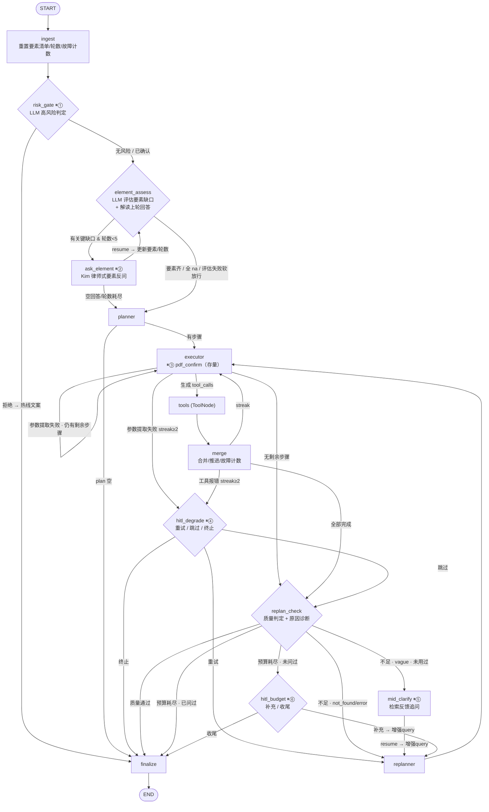

# lawApp_LangGraph — 基于 LangGraph 的 Plan & Execute 法律智能咨询系统

## 一、项目定位

一个**生产级法律咨询 AI Agent 系统**，面向婚姻家庭法领域，基于 LangGraph 框架实现 Plan & Execute（先规划后执行）架构。支持多轮对话、混合检索增强生成(CRAG)、长期记忆、联网搜索补充、PDF 报告导出，通过 FastAPI 提供 RESTful + SSE 流式 API 服务。

---

## 二、技术架构总览

### 2.1 整体拓扑

```
用户 → FastAPI (/ask, /ask/resume, /ask/stream, /ask/pdf)
         ↓
    LangGraph StateGraph (Plan & Execute · 14 节点 · 6 处 HITL interrupt)
         ↓
    ┌─────────────────────────────────────────────────────────┐
    │ 入口问询环                                                │
    │   ingest → risk_gate ⏸① → element_assess                  │
    │             ⇅ ask_element ⏸② (要素驱动反问, ≤5 轮自适应环) │
    │ 执行环                                                    │
    │   planner (Pro) → executor (Flash) ⏸③                    │
    │             ⇄ tools (ToolNode) → merge (推进/故障计数)     │
    │             连续失败 ≥2 → hitl_degrade ⏸④ (重试/跳过/终止) │
    │ 质量门控                                                  │
    │   replan_check (Flash 判质量 + 诊断不足原因)                │
    │     ├ 笼统 → mid_clarify ⏸⑤ → replanner (先问人后搜网)     │
    │     ├ 覆盖不到/出错 → replanner (Pro) → executor          │
    │     └ 预算耗尽 → hitl_budget ⏸⑥ → replanner / finalize    │
    │   finalize → END (组装最终回答)                            │
    └─────────────────────────────────────────────────────────┘
         ↓                ↓                ↓
   [Pinecone]      [SerpAPI]       [PostgreSQL+pgvector]
   混合检索+重排    联网搜索补充      长期记忆/法条存取
```

### 2.2 核心设计模式

- **Plan & Execute Agent**：先由强模型制定完整执行计划，再由轻量模型逐步执行，大幅降低单次推理成本
- **CRAG (Corrective RAG)**：检索 → 评估(三档) → 质量判定 → 不足则联网补充 → 生成分析
- **Dual LLM 架构**：Pro 模型负责规划/重规划(需要强推理)，Flash 模型负责执行/质量门控/风险判定/要素评估/检索反馈追问(降低成本与延迟)
- **要素驱动问询 (HITL)**：7 要素清单 + ≤5 轮自适应澄清环；执行中降级/检索反馈/预算耗尽三处人工介入，全部经 `interrupt()` → `Command(resume=...)` 机制驱动
- **优雅降级**：每个 LLM 调用点都有 fallback 机制（计划输出失败→默认检索计划，执行器 LLM 失败→严格重试一次后标记 failed 并计入连败，风险判定失败→放行，要素评估失败→软放行进 planner，检索反馈追问失败→静默转联网，语义判断失败→规则兜底）

---

## 三、Graph 节点详解 (LangGraph_lawApp.py)

子项目 A「问询与协同」将主图从 9 节点扩展为 **14 节点 + 9 条件路由**：入口澄清环（ingest / risk_gate / element_assess / ask_element）与执行中 HITL（mid_clarify / hitl_degrade / hitl_budget）均为图上可见的环，可经 `langgraph dev` / LangSmith 直接可视化。

### 3.1 整体流程图（Mermaid）



六处 interrupt 标号：⏸① `risk_confirm`、⏸② `clarify`、⏸③ `pdf_confirm`（存量）、⏸④ `degrade_confirm`、⏸⑤ `mid_clarify`、⏸⑥ `budget_confirm`。

### 3.2 节点职责表（14 节点）

| 节点 | LLM | 职责 |
|------|-----|------|
| `ingest` | — | 每轮请求入口：存量重置 + 重建默认要素清单（7 要素）、`clarify_rounds`/`error_streak` 归零、一次性标记复位、`clarify_history` RESET |
| `risk_gate` | Flash | `RiskSchema{high_risk, reason}` 高风险判定（自伤自杀/正在发生家暴/扬言报复/刑事自首/未成年人受害）；高风险未确认 → ⏸①，拒绝 → 热线文案中止；LLM 失败视为无风险放行 |
| `element_assess` | Flash | 双职责：① 解读上一轮用户回答（`element_updates`）映射到要素；② 评估剩余关键缺口生成 `pending_questions`（≤3 个律师式反问，按案由动态提升关键级）；非婚姻家事 → 全 na 直通；LLM 失败 → done=True 软放行 |
| `ask_element` | — | 读 `pending_questions` 发 ⏸②（载荷含 `round: "n/5"` 与要素面板快照）；resume 后写 `clarify_history`、`clarify_rounds+1`、答案织入增强 query；LLM-free |
| `planner` | Pro | `PlanSchema` 生成 JSON 计划 + 思考链（≤8 步）；失败兜底默认法律检索四步计划（检索案例→评估质量→检索法条→综合分析）；提示词注入「已知案件要素」段（`digest()`） |
| `executor` | Flash | 为当前步骤生成 tool_calls（bind_tools 全量 ALL_TOOLS 含 MCP）；LLM 失败严格重试一次，再失败标记 failed 并 `error_streak+1`；`markdown_to_pdf` 步骤前 ⏸③ 确认（存量） |
| `tools` | — | prebuilt ToolNode 执行工具（构建时读取 `ALL_TOOLS()` 快照，`handle_tool_errors=True`） |
| `merge` | — | 解析 ToolMessage 合并状态字段、记录 ToolCallRecord、推进步骤索引；新增：工具报错 `error_streak+1`、成功清零；重建 `PromptsRecord`（含 `known_elements` digest） |
| `replan_check` | Flash | `ReplanCheckSchema` 质量门控 + 不足原因诊断 `insufficient_reason: vague/not_found/error/none`；LLM 失败回退 `_fallback_replan_check` 规则判断 |
| `mid_clarify` | Flash | ⏸⑤ 检索反馈追问：基于评估结论 + top 检索文档摘要生成一个聚焦追问；resume 非空 → query 增强后转 replanner 重检索；LLM 失败静默走 replanner 联网兜底 |
| `hitl_degrade` | — | ⏸④ 故障降级询问：`error_streak≥2` 且未用过时触发，选项 重试/跳过/终止；LLM-free 纯记账 |
| `hitl_budget` | — | ⏸⑥ 预算耗尽询问：工具调用数达 `MAX_ROUNDS=10` 且未问过时触发，选项 补充/收尾；LLM-free |
| `replanner` | Pro | 基于已执行步骤生成**补充**步骤（不重复已完成，≤3 步）；失败兜底"联网搜索 + 法律分析"两步 |
| `finalize` | Flash | 组装最终回答：已有 final_answer 直接用；有 RAG 文档 → `FINALIZE_CASE_PROMPT` 兜底；都没有 → `FINALIZE_DIRECT_PROMPT` 直答（v2 均为 Kim 人设） |

### 3.3 条件路由（9 个 route 函数）

| 路由函数 | 判断 | 分支 |
|---------|------|------|
| `route_after_risk_gate` | 已有 final_answer（拒绝热线文案） | finalize / element_assess |
| `route_after_assess` | `pending_questions` 非空 且 `clarify_rounds < 5` | ask_element / planner |
| `route_after_ask` | `clarify_rounds >= 5`（含空回答置满） | planner / element_assess |
| `route_after_planner` | plan 是否为空（闲聊直答） | executor / finalize |
| `route_after_executor` | `error_streak>=2` 且未用过降级 → hitl_degrade；最新 AIMessage 带 tool_calls → tools；否则按剩余步骤 | tools / hitl_degrade / executor / replan_check |
| `route_after_merge` | 同 executor 的降级分支 + 剩余步骤 | executor / hitl_degrade / replan_check |
| `route_after_replan_check` | 优先级短路（见下） | finalize / mid_clarify / replanner / hitl_budget |
| `route_after_degrade` | resume 结果：终止(final_answer 已写) / 重试(replan_needed) / 跳过(默认) | finalize / replanner / replan_check |
| `route_after_budget` | resume 结果：补充(replan_needed) / 收尾(默认) | replanner / finalize |

`route_after_replan_check` 优先级（自上而下短路）：

```
1. needs_replan=False                        → finalize
2. executed >= MAX_ROUNDS(10):
     budget_hitl_used=True                   → finalize
     否则                                    → hitl_budget
3. needs_replan=True:
     insufficient_reason=vague 且未用过 mid   → mid_clarify
     否则(not_found/error/已用过)            → replanner
```

### 3.4 关键机制

- **澄清循环（⏸②）**：`element_assess` → `ask_element` → resume → 回 `element_assess`。评估与追问拆成两节点，避免 resume 重跑时白跑评估 LLM。每轮交互 = 一次 interrupt + 一次 resume；`clarify_rounds` 在 resume 处理后自增。
- **空回答语义**：用户对反问回复空文本 → 视为跳过，`clarify_rounds` 直接置为上限，按原问题继续。
- **非法律问题直通**：`element_assess` 判定非婚姻家事类咨询（闲聊/概念解释）→ 全要素置 na，零反问直通 planner。
- **检索反馈联动（⏸⑤）**：`replan_check` 诊断不足原因为 `vague` 且 `mid_clarify_used=False` → `mid_clarify` 用 Flash LLM 基于 top 检索文档摘要生成一个聚焦追问 → resume 非空则 query 增强为 `{query}\n[检索反馈追问] {question}\n[用户澄清] {answer}` → replanner 以细化后 query 重新生成检索步骤；resume 空 → replanner 联网兜底。**先问人、后搜网**。
- **故障降级（⏸④）**：`error_streak` 在 executor（参数提取两次失败）与 merge（ToolMessage status=error）两处累计、任一成功清零；`>=2` 且 `degrade_used=False` → interrupt `{type, failed_tool, options:[重试/跳过/终止]}`。重试 → 清零 streak、`replan_reason="用户要求重试失败的服务调用"` → replanner；跳过 → 清零 streak → replan_check；终止 → finalize。`degrade_used=True` 一次性，再失败由 replan_check 质量门控收口，避免 degrade↔replanner 死循环。
- **预算兜底（⏸⑥）**：`route_after_replan_check` 第 2 分支触发。interrupt `{type, missing: 关键缺口摘要+质量结论, options:[补充/收尾]}`。补充文本 → query 增强 `[补充信息]`、`budget_hitl_used=True` → replanner 生成最后一批步骤（≤3 步）；收尾 → finalize 带现有材料兜底。只问一次。

---

## 四、RAG 检索增强系统 (RAG_service/RAG_program.py)

### 4.1 混合检索策略

```
用户Query
   ├─→ BGE-large-zh-v1.5 (密集向量, 1024维)
   ├─→ BM25Encoder (稀疏向量, 预训练参数)
   └─→ hybrid_convex_scale(alpha=0.7) 融合
        ↓
   Pinecone 混合查询 (dotproduct 度量, dense vector type)
        ↓
   BGE-reranker-large CrossEncoder 重排序
        ↓
   返回 Top-N 重排序结果
```

### 4.2 关键技术选型
- **向量数据库**：Pinecone Serverless（aws us-east-1），dotproduct 度量
- **密集嵌入**：BAAI/bge-large-zh-v1.5（1024 维，中文优化，归一化嵌入）
- **稀疏编码**：pinecone-text BM25Encoder，预计算参数文件 ~387KB
- **重排序**：BAAI/bge-reranker-large CrossEncoder，全注意力机制让查询与文档充分交互
- **文本分割**：MarkdownHeaderTextSplitter（按一级标题分割案例）+ RecursiveCharacterTextSplitter（chunk_size=512, overlap=50）

### 4.3 数据规模
- 11 个 Markdown 法院案例文件（2014-2024 年度婚姻家庭与继承纠纷）
- 约 5030 条向量记录
- 每个案例包含：案号、案由、基本案情、案件焦点、裁判要旨、法官后语

---

## 五、工具系统 (tools/)

### 5.1 工具清单（8 个本地工具 + MCP 动态扩展）

| 工具名 | 分类 | 功能 | 关键细节 |
|-------|------|------|---------|
| `retrieve_legal_knowledge` | CRAG管线 | 混合检索法律案例 | 懒加载 RAG_service 单例，支持 top_k/rerank_top_n/alpha/namespace 参数调优 |
| `evaluate_case_relevance` | CRAG管线 | 三档质量评估 | correct(≥0.7) / ambiguous(0.3~0.7) / incorrect(<0.3)；≥3条高质量或可用→"充足" |
| `analyze_legal_issue` | CRAG管线 | LLM 法律分析生成 | Kim Wexler 角色设定（默认，`LEGAL_ANALYSIS_ROLE=saul` 彩蛋切换），整合高/中相关案例+法条+网络资料，返回 final_answer+sources |
| `fetch_laws` | 法条检索 | 法律条文语义检索 | PostgreSQL+pgvector `law_vector` 表，BGE 嵌入，返回法规名/章节/条款号/原文 |
| `get_google_search` | 外部搜索 | SerpAPI 谷歌搜索 | 最多8条结构化结果，用于检索不足时联网补充 |
| `search_memory` | 长期记忆 | 语义搜索历史记忆 | LangGraph BaseStore 向量语义检索（PostgresStore + BGE 嵌入），无索引时退化取最近条目 |
| `save_to_memory` | 长期记忆 | 保存事实/偏好 | content 存完整原文、summary（≤512字截断）用于向量嵌入，memory_type 分类 |
| `markdown_to_pdf` | 输出 | Markdown→PDF报告 | markdown库转HTML + pdfkit(wkhtmltopdf)，A4页面，中文字体 |

> **提示词集中（v2）**：全部 LLM 提示词与 interrupt 文案已收拢至 `lawApp_LangGraph/prompts.py` 单一模块（每个提示词头部带 v1→v2 版本注释）。工具模块不再内嵌提示词，如 `analyze_legal_issue` 的角色人设改经 `get_analysis_prompt()` 引入。详见「八、角色设定与提示词工程」。

### 5.2 长期记忆系统 (tools/db_tools.py)

- **存储**：LangGraph `BaseStore`（生产为 PostgresStore 持久化 + 1024 维 BGE 向量索引，开发可用 InMemoryStore），由 FastAPI lifespan 经 `runtime.py` 注入图实例；跨 thread 共享
- **访问方式**：工具内经 `langgraph.config.get_store()` 取当前 store，命名空间 `("law_agent", "memories")`；离线（图上下文外）调用时优雅降级返回空
- **语义检索**：`search_memory` 走 store 向量索引；无向量索引的 store 自动退化为取最近条目
- **写入**：`save_to_memory` 的 content 存完整原文、summary（≤512 字，超出截断）用于向量嵌入，memory_type 分类（user_fact / legal_preference / conclusion / general）
- **法条检索**：`fetch_laws` 走 PostgreSQL `law_vector` 表（pgvector，`<=>` 余弦距离排序，仅取"现行有效"法条），async psycopg3 连接池

---

## 六、数据模型体系 (state.py)

三层 Pydantic v2 模型，统一全项目数据格式：

```
A. 工具返回层
   ├── RetrievedDocument: rank, id, hybrid_score, year, case_number, case_cause, chunk_text
   ├── EvaluationResult: total, correct_count, ambiguous_count, incorrect_count, quality_verdict, 三档分类列表
   ├── LawsResult: law_title, chapter, article_number, content
   └── WebSearchResult: title, link, snippet

B. 计划执行层
   ├── PlanStep: step_id, description, tool_name, status(pending/doing/done/failed), retry_count
   └── ToolCallRecord: step_id, tool_name, tool_input, output, timestamp

C. 顶层 AgentState
   ├── 会话标识: session_id, user_id
   ├── 请求上下文: query, is_pdf_output, messages
   ├── 计划执行: plan, current_step_index, replan_needed, replan_reason, insufficient_reason
   ├── HITL 问询: case_elements(要素清单), clarify_history, pending_questions, clarify_rounds,
   │              error_streak, 一次性标记(mid_clarify_used/budget_hitl_used/degrade_used)
   ├── 输出: final_answer, reasoning(思考链)
   ├── 管线数据: rag_documents, evaluation, web_search_results, law_results, crag_context
   ├── 长期记忆: memory_results, memory_update
   └── 流程控制: should_continue, error
```

子项目 A 新增**案件要素模型**（state.py）：`CaseElements`（7 要素清单状态机，方法 `digest()`/`critical_missing()`/`mark_na()`/`promote()`/`update()`）、`CaseElement`（key/label/critical/status:known-missing-na/value/updated_by）、`ElementQuestion`（key+question）、`ClarifyExchange`（澄清历史，append reducer）；常量 `MAX_CLARIFY_ROUNDS=5`、`ERROR_STREAK_THRESHOLD=2`。默认 7 要素：`marriage_status`/`demand`/`property`（关键）+ `children`/`timeline`/`evidence`/`opposing_stance`（常规）。

---

## 七、Web 服务层 (FastAPI/)

### 7.1 API 端点

| 端点 | 方法 | 功能 |
|------|------|------|
| `/ask` | POST | 同步问答，返回完整 JSON 响应 |
| `/ask/resume` | POST | HITL 恢复：用户对 interrupt 的回复经 `normalize_resume` 类型感知归一后以 `Command(resume=...)` 续跑图 |
| `/ask/stream` | GET | SSE 流式问答，实时推送规划进度/工具调用/要素面板(elements)/interrupt/最终回答 |
| `/ask/pdf` | POST | 生成 PDF 法律报告并返回文件下载 |
| `/feedback` | POST | 记录用户对回答的评分反馈（1-5 星 + 评论） |
| `/tools` | GET | 列出所有可用工具及描述 |
| `/home` | GET | 健康检查 + 服务信息 |

### 7.2 请求/响应模型 (model.py)
- `QueryRequest`：query (1-5000字符) + session_id (可选，支持多轮对话)
- `ResumeRequest`：session_id + answer (用户对 interrupt 的回复，≤3000 字符)
- `QueryResponse`：query + session_id + final_answer + sources + tool_calls + reasoning + interrupt (等待用户回复的 HITL 载荷，通用 dict) + elements (案件要素面板数据，子项目A 新增)

### 7.3 会话管理 (utils.py)
- 自动生成/复用 session_id
- 使用 LangGraph `MemorySaver` 检查点机制实现线程级会话隔离
- 通过 `graph.ainvoke()` 异步调用，支持并发请求
- `normalize_resume(interrupt_type, answer)`：`/ask/resume` 先 `aget_state` 读取当前 interrupt 类型再归一用户回复——`risk_confirm`/`pdf_confirm` → bool、`degrade_confirm` → retry/skip/abort、`budget_confirm` → finish 或补充原文、`clarify`/`mid_clarify` → 原文透传（空=跳过）
- 六类 interrupt 复用既有 `hitl_event` → `audit` 审计链路；SSE 新增 `elements` 事件（`element_assess` 节点推送要素面板状态，演示"要素表逐格点亮"）

### 7.4 结构化日志系统 (logging.py)

**五类日志**，使用 contextvars 实现 session_id 全链路透传：

| Logger | 输出目标 | 级别 | 用途 |
|--------|---------|------|------|
| agent_flow | 文件(轮转) + 控制台 | INFO+ | 每次请求的流程摘要 |
| agent_debug | 控制台 | DEBUG | 节点级详细执行链路 |
| tool | 控制台 | DEBUG | 工具调用参数/返回值摘要 |
| rag | 控制台 | DEBUG | RAG 检索各环节耗时 |
| system | 文件(轮转) + 控制台 | INFO+ | 启动/关闭/异常 |

**日志格式**：
- 控制台：`15:37:22 | INFO  | sess_1234 | agent_flow | Message | summary | detail | result`（带 ANSI 颜色）
- 文件：`2026-05-18 10:37:22 | INFO  | sess_1234 | agent_flow | Message`

**便捷包装器**：`flow.info()`, `debug.debug()`, `tool.info()`, `rag.debug()`, `system.warning()` 等，支持 `summary`/`detail`/`result` 额外参数。

---

## 八、角色设定与提示词工程 (prompts.py)

子项目 A 将全部提示词从 `LangGraph_lawApp.py` / `rag_tools.py` 收拢进 `lawApp_LangGraph/prompts.py` 单一模块（每个提示词头部带 v1→v2 版本注释），并统一了全链路人设。

### 8.1 Kim Wexler 全链路统一

- **人设**：Kim Wexler（《风骚律师》中的资深律师）— 专业沉稳、极度务实、用大白话、先一句共情再切法律事实与可行方案，给当事人掌控感
- `KIM_PERSONA_BLOCK` 公共人设块注入四处生成点：
  - **要素反问**（`ELEMENT_ASSESS_PROMPT`，element_assess 生成的律师式反问）
  - **检索反馈追问**（`MID_CLARIFY_PROMPT`，mid_clarify 的聚焦追问）
  - **兜底回答**（`FINALIZE_CASE_PROMPT` / `FINALIZE_DIRECT_PROMPT`，v2 起换为 Kim 人设）
  - **法律分析**（`LEGAL_ANALYSIS_PROMPT_KIM`，默认角色）
- 问询、追问、兜底、分析四类输出人格统一，消除旧版多角色混用的人格分裂

### 8.2 Saul Goodman 环境变量彩蛋

- 设 `LEGAL_ANALYSIS_ROLE=saul` 时，**仅法律分析**（`analyze_legal_issue`）切换为 Saul Goodman 人设（市侩幽默、江湖气、攻击性辩护策略，`LEGAL_ANALYSIS_PROMPT_Saul`）
- 切换由 `get_analysis_prompt()` 读取环境变量完成；反问/兜底恒为 Kim — 角色彩蛋不扩散到问询链路

### 8.3 六处 HITL interrupt 清单

| 标号 | interrupt 类型 | 触发节点 | 载荷形状 | resume 归一 (utils.normalize_resume) |
|------|---------------|---------|---------|------|
| ⏸① | `risk_confirm` | risk_gate | {type, message} | y/yes/是/确认→True；n/no/否→False（拒绝→热线文案中止） |
| ⏸② | `clarify` | ask_element | {type, round: "n/5", question, elements: [{key, label, status}]} | 原文透传；空=跳过（轮数置满，按原问题继续） |
| ⏸③ | `pdf_confirm` | executor（存量） | {type, message} | y→True；否→False（跳过 PDF 步骤） |
| ⏸④ | `degrade_confirm` | hitl_degrade | {type, failed_tool, options: [重试/跳过/终止], message} | 重试→"retry"；终止→"abort"；默认"skip" |
| ⏸⑤ | `mid_clarify` | mid_clarify | {type, question, context_hint} | 原文透传；空=转联网兜底 |
| ⏸⑥ | `budget_confirm` | hitl_budget | {type, missing, options: [补充/收尾], message} | 空回复或含"收尾"→"finish"；其余非空原文透传为补充信息 |

### 8.4 提示词模板清单（prompts.py v2）

| 提示词 | 输出 Schema | 要点 |
|--------|-------------|------|
| `KIM_PERSONA_BLOCK` | —（注入片段） | Kim 人设公共块，注入反问/追问/兜底/分析 |
| `RISK_GATE_PROMPT` | `RiskSchema{high_risk, reason}` | 判定面：自伤自杀/正在发生家暴/扬言报复/刑事自首/未成年人受害 |
| `ELEMENT_ASSESS_PROMPT` | `ElementAssessmentSchema` | 要素评估 + 反问生成（≤3 个）；分案由指引（彩礼→timeline 升关键；抚养权→children+opposing_stance 升关键；继承→timeline 升关键） |
| `MID_CLARIFY_PROMPT` | `MidClarifySchema{question, element_key}` | 检索反馈追问，聚焦一个模糊点 |
| `REPLAN_CHECK_PROMPT` v2 | `ReplanCheckSchema` + `insufficient_reason` | 诊断标准：检索空/普遍低分→not_found；有量但反复 ambiguous 且 query 笼统→vague；执行错误→error |
| `PLANNER_SYSTEM` v2 / `EXECUTOR_PROMPT` v2 | `PlanSchema` / — | 注入「已知案件要素」段（`digest()`） |
| `REPLANNER_SYSTEM_PROMPT` | `PlanSchema` | 补充步骤生成，只输出新增步骤（≤3 步） |
| `FINALIZE_CASE_PROMPT` / `FINALIZE_DIRECT_PROMPT` v2 | — | 兜底回答 Kim 人设 + 免责声明行 |
| `DEGRADE_CONFIRM_MSG` / `BUDGET_CONFIRM_MSG` | —（静态模板） | interrupt 文案，不调 LLM |
| `LEGAL_ANALYSIS_PROMPT_KIM` / `LEGAL_ANALYSIS_PROMPT_Saul` | — | 分析角色双版本，经 `get_analysis_prompt()` 按 `LEGAL_ANALYSIS_ROLE` 切换 |

`digest()` 注入链：planner 提示词「已知案件要素」段 → executor 提示词（`elements_digest` 变量） → 分析上下文（merge 填充 `PromptsRecord.known_elements` → `_build_analysis_context`）。模板渲染、Kim 标记与 digest 注入断言由 `prompts_test.ipynb` 验证。

---

## 九、技术栈清单

| 层级 | 技术 | 版本 | 作用 |
|------|------|------|------|
| **Agent 框架** | LangGraph | ≥1.2 (<2) | StateGraph 状态图编排、interrupt/Command HITL、MemorySaver/PostgresSaver 会话检查点、BaseStore 长期记忆 |
| **LLM 基座** | langchain-openai (DeepSeek) | ≥0.2.0 | ChatOpenAI 兼容接口调用 DeepSeek API |
| **Web 框架** | FastAPI + Uvicorn | ≥0.115 / ≥0.32 | REST API + SSE 流式 + CORS 中间件 |
| **数据模型** | Pydantic | ≥2.7 | 全项目统一数据模型、请求/响应校验 |
| **向量数据库** | Pinecone | ≥5.0 | Serverless 混合检索（密集+稀疏向量） |
| **嵌入模型** | BAAI/bge-large-zh-v1.5 | - | 1024维中文语义向量 |
| **重排序** | BAAI/bge-reranker-large | - | CrossEncoder 全注意力重排序 |
| **稀疏编码** | pinecone-text (BM25) | ≥0.4 | BM25 关键词匹配 |
| **长期记忆** | LangGraph BaseStore (PostgresStore) + PostgreSQL 15/pgvector | - | 跨会话语义记忆存储与法条检索 |
| **联网搜索** | SerpAPI (google-search-results) | ≥2.4 | 法律信息联网补充 |
| **PDF 生成** | markdown + pdfkit (wkhtmltopdf) | ≥3.7 / ≥1.0 | Markdown→HTML→PDF |
| **文本分割** | langchain-text-splitters | ≥0.3 | Markdown 标题分割 + 递归字符分割 |
| **日志** | Python logging + contextvars | 标准库 | 5类结构化日志 + 会话透传 |
| **配置管理** | python-dotenv | ≥1.0 | .env 环境变量管理 |
| **调试追踪** | LangSmith | - | LLM 调用链追踪（可选） |
| **嵌入工具** | sentence-transformers | ≥3.0 | 本地运行 BGE 嵌入与重排序模型 |

---

## 十、项目亮点

### 10.1 架构亮点
1. **双 LLM 成本优化**：规划用 Pro（慢但强），执行用 Flash（快但便宜），单次查询可节省 40-60% token 成本
2. **Plan & Execute 柔性管线**：不是硬编码的线性流程，Agent 可根据问题复杂度自主决定执行路径（法律问题走完整 CRAG、闲聊直接回答）
3. **三级降级策略**：JSON 解析降级 → LLM 调用降级 → 规则判断降级，确保系统在任何异常下都能给出合理响应
4. **质量闭环**：检索→评估→补充→重规划，形成自我纠错的闭环
5. **HITL 全链路**：6 处 interrupt 覆盖入口风险确认/要素澄清/PDF 确认/故障降级/检索反馈/预算耗尽，把关键决定权交给用户；`case_elements` + `clarify_history` 为记忆系统（子项目B）预留结构化原料

### 10.2 检索亮点
1. **混合检索**：密集语义匹配 + 稀疏关键词匹配，alpha 可调权重，兼顾"意思相近"和"关键词命中"
2. **CrossEncoder 重排序**：不是简单的向量距离，而是让查询和每个文档经过全注意力交互后打分，大幅提升 Top-N 精度
3. **CRAG 三档评估**：阈值可配，Agent 可根据评估结论自主决策是否需要联网补充

### 10.3 工程亮点
1. **Pydantic v2 全链路类型安全**：从工具返回到图状态到 API 响应，整个数据流都有类型约束
2. **懒加载单例模式**：RAG_service / LLM / Embedder / DB 连接全部懒加载，避免冷启动时一次性加载所有重模型
3. **5类结构化日志 + contextvars 会话透传**：无需修改任何函数签名，session_id 自动注入所有日志
4. **SSE 流式推送**：用户可实时看到规划进度和工具调用，避免长时间等待的焦虑
5. **优雅降级无处不在**：每个可能失败的点都有 fallback，生产环境友好

### 10.4 数据亮点
1. **约 5030 条向量化法律案例**：覆盖 2014-2024 年婚姻家庭与继承纠纷
2. **长期记忆系统**：跨会话保留用户偏好/事实/决策，支持个性化服务
3. **BM25 参数预计算**：避免每次启动重新拟合，启动即用

---

## 十一、数据流全景

```
用户: "离婚后彩礼能要回来吗?"
  │
  ├─ [FastAPI] 接收请求, 生成/复用 session_id
  │
  ├─ [ingest] 重建 7 要素清单, 澄清轮数/连败计数归零
  │
  ├─ [risk_gate] Flash LLM 判定 → 无高风险, 放行
  │
  ├─ [element_assess] Flash LLM 评估: 彩礼纠纷 → timeline 升关键,
  │   关键要素仍缺 → [ask_element] ⏸② 律师式反问
  │   "结婚多少年了? 彩礼是婚前还是婚后给的? 现在还共同生活吗?"
  │   → 用户补充: "结婚3年, 婚前给的, 一直共同生活"
  │   → 要素点亮(婚姻现状/timeline), 下一轮评估 done → 进 planner
  │
  ├─ [planner] Pro LLM 分析 (digest 注入: 婚姻现状:结婚3年 | 关键时间线:婚前彩礼)
  │   → reasoning: ["涉及婚姻财产纠纷", "需检索彩礼返还相关判例", ...]
  │   → plan: [
  │       {step_id:1, tool: retrieve_legal_knowledge},
  │       {step_id:2, tool: evaluate_case_relevance},
  │       {step_id:3, tool: analyze_legal_issue}
  │     ]
  │
  ├─ [executor #1] Flash LLM → 调用 retrieve_legal_knowledge("离婚彩礼返还")
  │   → Pinecone 混合检索 → BGE-reranker 重排序
  │   → 返回 5 条案例 (rag_documents)
  │
  ├─ [executor #2] Flash LLM → 调用 evaluate_case_relevance(rag_documents)
  │   → 2条 correct, 1条 ambiguous, 2条 incorrect
  │   → quality_verdict: "不足,建议进行网络搜索补充" (correct<3)
  │
  ├─ [replan_check] Flash LLM 判断 → needs_replan=true
  │   → insufficient_reason=not_found (案例库覆盖不足)
  │   (若诊断为 vague 且未追问过 → mid_clarify ⏸⑤ 先问人后搜网)
  │
  ├─ [replanner] Pro LLM → 新增步骤:
  │   {step_id:4, tool: get_google_search}
  │   {step_id:5, tool: analyze_legal_issue}
  │
  ├─ [executor #3] → 调用 get_google_search("离婚彩礼返还 最新司法解释")
  │   → SerpAPI 返回 8 条网络资料 (web_search_results)
  │
  ├─ [executor #4] Flash LLM → 调用 analyze_legal_issue(
  │     query, correct_cases, ambiguous_cases, web_results
  │   )
  │   → Kim Wexler 风格法律分析 (final_answer, sources)
  │
  ├─ [replan_check] → needs_replan=false (已有 final_answer)
  │
  └─ [finalize] → 返回 final_answer → FastAPI → JSON/SSE 响应
```

---

## 十二、已知问题与改进方向

1. **递归限制**：当前 LangGraph recursive limit = 25，极复杂查询可能触发 `GRAPH_RECURSION_LIMIT` 错误
2. **BM25 路径硬编码**：`bm25_law_params.json` 路径为绝对路径，需改为相对路径或配置化
3. **角色切换**：分析角色已支持环境变量切换（`LEGAL_ANALYSIS_ROLE=saul` 彩蛋，默认 Kim Wexler 全链路统一）；会话级/用户偏好级动态切换留待后续迭代
4. **并发性能**：工具中的懒加载单例在多线程/多进程下可能存在竞争条件，生产环境建议使用连接池
5. **评估阈值**：CORRECT_THRESHOLD(0.7)、INCORRECT_THRESHOLD(0.3)、MIN_QUALITY_DOCS(3) 等常量可能需要根据检索质量持续调优

---

## 十三、项目目录结构

```
lawApp_LangGraph/
├── LangGraph_lawApp.py          # 主入口：14 节点 Plan & Execute 主图 + 9 条件路由 + 6 处 HITL interrupt
├── state.py                     # 统一 Pydantic 数据模型 (三层模型体系 + 案件要素清单)
├── prompts.py                   # 提示词集中模块 (v2)：Kim 人设/要素评估/检索反馈追问/interrupt 文案
├── db.py                        # PostgreSQL 访问 (反馈/审计记录)
├── mcp_client.py                # MCP 客户端：动态挂载外部 MCP 工具
├── mcp_server.py                # MCP 服务端：law-search 工具对外暴露
├── runtime.py                   # 运行时装配 (持久化 checkpointer/store 注入)
├── requirements.txt / requirements.lock
├── sample_law.txt               # 法律文本样例
│
├── FastAPI/                     # Web 服务层
│   ├── api.py                   # FastAPI 应用 (v3.0.0), 7 个端点 + SSE + HITL 恢复
│   ├── model.py                 # 请求/响应 Pydantic 模型 (QueryResponse 含 elements/interrupt)
│   ├── utils.py                 # 会话管理、normalize_resume 类型感知归一、响应构建、SSE工具
│   └── logging.py               # 5类结构化日志系统 + contextvars 会话透传
│
├── tools/                       # Agent 工具集
│   ├── __init__.py              # 工具注册表 (LOCAL_TOOLS 8 个 + MCP_TOOLS 动态扩展)
│   ├── tools.py                 # 网络搜索(SerpAPI) + PDF生成(markdown+pdfkit)
│   ├── rag_tools.py             # CRAG 管线工具 (检索/评估/分析；提示词已迁 prompts.py)
│   ├── db_tools.py              # 长期记忆 + 法条检索工具 (PostgreSQL+pgvector+BGE)
│   └── tools_test.ipynb         # 工具测试笔记本
│
├── RAG_service/                 # RAG 向量检索服务
│   ├── RAG_program.py           # RAG_service 类: 混合检索 + BM25 + CrossEncoder 重排序
│   ├── pinecone_retriever.py   # Pinecone 混合检索封装
│   ├── pgvector_retriever.py    # pgvector 法条检索封装
│   ├── embedder.py              # BGE 嵌入/重排序模型懒加载单例
│   ├── base.py                  # 检索器抽象基类
│   ├── bm25_law_params.json     # 预计算 BM25 参数 (~387KB)
│   └── RAG_Service_Test.ipynb   # RAG 测试笔记本
│
├── node/                        # 备用节点工厂(legacy 实现)
│   ├── langgraph_nodes.py       # 节点工厂函数 (替代架构)
│   └── nodes_test.ipynb         # 节点测试笔记本
│
├── Documents/                   # 法律文档数据
│   ├── LawDocument/             # 7个相关法律 TXT 文件 (民法典、反家暴法、涉彩礼解释等)
│   └── MarkDownFiles/           # 11个案例 MD 文件 (2014-2024年度)
│
├── clarify_test.ipynb           # 要素澄清循环测试 (7 用例, scripts/run_nb.py 执行)
├── hitl_test.ipynb              # 执行中 HITL 测试 (6 用例: mid_clarify/degrade/budget)
├── prompts_test.ipynb           # 提示词模板/人设/digest 注入测试 (3 用例)
│
├── logs/                        # 运行时日志 (agent_flow.log/system.log, 轮转)
├── pdf_outputs/                 # 生成的 PDF 报告
└── PGtest.ipynb                 # PostgreSQL 数据入库笔记本
```

---

## 十四、部署与运行

```bash
# 1. 安装依赖
pip install -r requirements.txt

# 2. 配置环境变量 (.env)
DEEPSEEK_API_KEY=xxx
DEEPSEEK_BASE_URL=https://api.deepseek.com
DEEPSEEK_PRO_MODEL=deepseek-reasoner    # Pro 规划模型
DEEPSEEK_FLASH_MODEL=deepseek-chat      # Flash 执行模型
PINECONE_API_KEY=xxx
PINECONE_INDEX_NAME=pinecone-law-agent
SERPAPI_API_KEY=xxx
DB_NAME=Law_app DB_USER=xxx DB_PASSWORD=xxx DB_HOST=localhost DB_PORT=5433
LEGAL_ANALYSIS_ROLE=kim                 # 可选彩蛋: saul 时法律分析切换 Saul Goodman 人设

# 3. 启动 FastAPI 服务
cd lawApp_LangGraph/FastAPI
python api.py
# 或
uvicorn lawApp_LangGraph.FastAPI.api:app --host 0.0.0.0 --port 8000 --reload
```

---

*文档生成时间：2026-09-10 | 项目版本：v3.1.0 (子项目A)*
